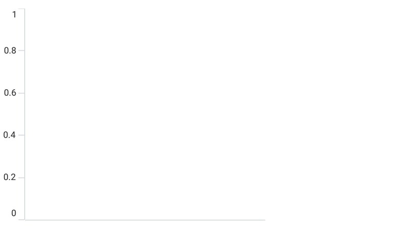
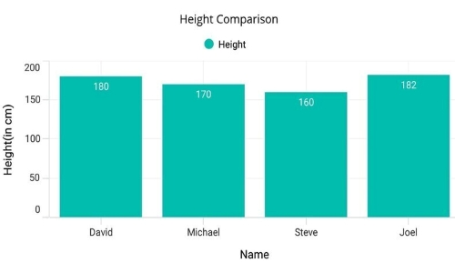

# GettingStarted_CartesianChart_MAUI

## Creating an application with .NET MAUI chart

1. Create a new .NET MAUI application in Visual Studio.
2. Syncfusion .NET MAUI components are available in [nuget.org](https://www.nuget.org/). To add SfCartesianChart to your project, open the NuGet package manager in Visual Studio, search for Syncfusion.Maui.Charts and then install it.
3. To initialize the control, import the Chart namespace.
4. Initialize [SfCartesianChart](https://help.syncfusion.com/cr/maui/Syncfusion.Maui.Charts.SfCartesianChart.html?tabs=tabid-1).

###### Xaml
```xaml
<ContentPage
    . . .    
    xmlns:chart="clr-namespace:Syncfusion.Maui.Charts;assembly=Syncfusion.Maui.Charts">

    <chart:SfCartesianChart/>
    
</ContentPage>
 ```
###### C#
```C#
using Syncfusion.Maui.Charts;
namespace ChartGettingStarted
{
    public partial class MainPage : ContentPage
    {
        public MainPage()
        {
            InitializeComponent();           
            SfCartesianChart chart = new SfCartesianChart(); 
            this.Content = chart; 
        }
    }   
}
```

## Register the handler

Syncfusion.Maui.Core nuget is a dependent package for all Syncfusion controls of .NET MAUI. In the MauiProgram.cs file, register the handler for Syncfusion core.
###### C#
```C#
using Microsoft.Maui;
using Microsoft.Maui.Hosting;
using Microsoft.Maui.Controls.Compatibility;
using Microsoft.Maui.Controls.Hosting;
using Microsoft.Maui.Controls.Xaml;
using Syncfusion.Maui.Core.Hosting;

namespace ChartGettingStarted
{
    public static class MauiProgram
    {
        public static MauiApp CreateMauiApp()
        {
            var builder = MauiApp.CreateBuilder();
            builder
            .UseMauiApp<App>()
            .ConfigureSyncfusionCore()
            .ConfigureFonts(fonts =>
            {
                fonts.AddFont("OpenSans-Regular.ttf", "OpenSansRegular");
            });

            return builder.Build();
        }
    }
}
```

## Initialize view model

Now, let us define a simple data model that represents a data point in the chart.
######
```C#
public class PersonModel   
{   
    public string Name { get; set; }
    public double Height { get; set; }
}
```
Next, create a PersonViewModel class and initialize a list of `PersonModel` objects as follows.
###### C#
```C#
public class PersonViewModel  
{
    public List<PersonModel> Data { get; set; }      

    public PersonViewModel()       
    {
        Data = new List<PersonModel>()
        {
            new PersonModel { Name = "David", Height = 170 },
            new PersonModel { Name = "Michael", Height = 96 },
            new PersonModel { Name = "Steve", Height = 65 },
            new PersonModel { Name = "Joel", Height = 182 },
            new PersonModel { Name = "Bob", Height = 134 }
        }; 
    }
 }
```

Set the `PersonViewModel` instance as the `BindingContext` of your page to bind `PersonViewModel` properties to the chart. 
 
* Add namespace of `PersonViewModel` class to your XAML Page, if you prefer to set `BindingContext` in XAML.
###### Xaml
```xaml
<ContentPage
    xmlns="http://schemas.microsoft.com/dotnet/2021/maui"
    xmlns:x="http://schemas.microsoft.com/winfx/2009/xaml"
    x:Class="ChartGettingStarted.MainPage"
    xmlns:chart="clr-namespace:Syncfusion.Maui.Charts;assembly=Syncfusion.Maui.Charts"
    xmlns:model="clr-namespace:ChartGettingStarted">

    <ContentPage.BindingContext>
        <model:PersonViewModel/>
    </ContentPage.BindingContext>
</ContentPage>
```
###### C#
```C#
this.BindingContext = new ViewModel();
```

## Initialize Chart axis

[ChartAxis](https://help.syncfusion.com/cr/maui/Syncfusion.Maui.Charts.ChartAxis.html) is used to locate the data points inside the chart area. The [XAxes](https://help.syncfusion.com/cr/maui/Syncfusion.Maui.Charts.SfCartesianChart.html?tabs=tabid-1#Syncfusion_Maui_Charts_SfCartesianChart_XAxes) and [YAxes](https://help.syncfusion.com/cr/maui/Syncfusion.Maui.Charts.SfCartesianChart.html#Syncfusion_Maui_Charts_SfCartesianChart_YAxes) collection of the chart is used to initialize the axis for the chart.
###### Xaml
```xaml
<chart:SfCartesianChart>                            
     <chart:SfCartesianChart.XAxes>
                    <chart:CategoryAxis>
                        <chart:CategoryAxis.Title>
                            <chart:ChartAxisTitle Text="Year" />
                        </chart:CategoryAxis.Title>
                    </chart:CategoryAxis>
                </chart:SfCartesianChart.XAxes>
    <chart:SfCartesianChart.YAxes>
        <chart:NumericalAxis/>
    </chart:SfCartesianChart.YAxes>                       
</chart:SfCartesianChart>
```
###### C#
```C#
    SfCartesianChart chart = new SfCartesianChart();
    CategoryAxis primaryAxis = new CategoryAxis();
    chart.XAxes.Add(primaryAxis);
    NumericalAxis secondaryAxis = new NumericalAxis();
    chart.YAxes.Add(secondaryAxis);
 ```
    
Run the project and check if you get following output to make sure you have configured your project properly to add a chart.



## Populate Chart with data

As we are going to visualize the comparison of heights in the data model, add [ColumnSeries](https://help.syncfusion.com/cr/maui/Syncfusion.Maui.Charts.ColumnSeries.html?tabs=tabid-1) to [Series](https://help.syncfusion.com/cr/maui/Syncfusion.Maui.Charts.SfCartesianChart.html#Syncfusion_Maui_Charts_SfCartesianChart_Series) property of chart, and then bind the `Data` property of the above `PersonViewModel` to the `ColumnSeries.ItemsSource` as follows.

* The cartesian chart has [Series](https://help.syncfusion.com/cr/maui/Syncfusion.Maui.Charts.SfCartesianChart.html#Syncfusion_Maui_Charts_SfCartesianChart_Series) as its default content.
* You need to set [XBindingPath](https://help.syncfusion.com/cr/maui/Syncfusion.Maui.Charts.ChartSeries.html#Syncfusion_Maui_Charts_ChartSeries_XBindingPath) and [YBindingPath](https://help.syncfusion.com/cr/maui/Syncfusion.Maui.Charts.XYDataSeries.html#Syncfusion_Maui_Charts_XYDataSeries_YBindingPath)
 properties so that chart will fetch values from the respective properties in the data model to plot the series. 

###### Xaml
```xaml
<chart:SfCartesianChart>
    <chart:SfCartesianChart.XAxes>
        <chart:CategoryAxis>
            <chart:CategoryAxis.Title>
                <chart:ChartAxisTitle Text="Name" />
            </chart:CategoryAxis.Title>
        </chart:CategoryAxis>
    </chart:SfCartesianChart.XAxes>
    <chart:SfCartesianChart.YAxes>
        <chart:NumericalAxis>
            <chart:NumericalAxis.Title>
                <chart:ChartAxisTitle Text="Height(in cm)" />
            </chart:NumericalAxis.Title>
        </chart:NumericalAxis>
    </chart:SfCartesianChart.YAxes>

    <chart:ColumnSeries ItemsSource="{Binding Data}" 
                        XBindingPath="Name" 
                        YBindingPath="Height" />
</chart:SfCartesianChart>
```
###### C#
```C#
SfCartesianChart chart = new SfCartesianChart();

// Initializing primary axis
CategoryAxis primaryAxis = new CategoryAxis();
primaryAxis.Title.Text = "Name";
chart.XAxes.Add(primaryAxis);

//Initializing secondary Axis
NumericalAxis secondaryAxis = new NumericalAxis();
secondaryAxis.Title.Text = "Height(in cm)";
chart.YAxes.Add(secondaryAxis);

//Initialize the two series for SfChart
ColumnSeries series = new ColumnSeries();
series.Label = "Height";
series.ShowDataLabels = true;
series.ItemsSource = (new PersonViewModel()).Data;
series.XBindingPath = "Name";
series.YBindingPath = "Height";

//Adding Series to the Chart Series Collection
chart.Series.Add(series);
```

## Add a title

The title of the chart provide quick information to the user about the data being plotted in the chart. The [Title](https://help.syncfusion.com/cr/maui/Syncfusion.Maui.Charts.ChartBase.html#Syncfusion_Maui_Charts_ChartBase_Title) property is used to set title for the chart as follows.
###### Xaml
```xaml
<Grid>
    <chart:SfCartesianChart>
        <chart:SfCartesianChart.Title>
            <Label Text="Height Comparison" />
        </chart:SfCartesianChart.Title> 
    </chart:SfCartesianChart>
</Grid>
```

###### C#
```C#
SfCartesianChart chart = new SfCartesianChart();
chart.Title = new Label
{
    Text = "Height Comparison"
};
```  

## Enable the data labels

The [ShowDataLabels](https://help.syncfusion.com/cr/maui/Syncfusion.Maui.Charts.ChartSeries.html#Syncfusion_Maui_Charts_ChartSeries_ShowDataLabels) property of series can be used to enable the data labels to improve the readability of the chart. The label visibility is set to `False` by default.
###### Xaml
```xaml
<chart:SfCartesianChart>
    . . . 
    <chart:ColumnSeries ShowDataLabels="True">
    </chart:ColumnSeries>
</chart:SfCartesianChart>
```

###### C#
```C#
SfCartesianChart chart = new SfCartesianChart()
. . .
ColumnSeries series = new ColumnSeries();
series.ShowDataLabels = true;
chart.Series.Add(series);
```  

## Enable a legend

The legend provides information about the data point displayed in the chart. The [Legend](https://help.syncfusion.com/cr/maui/Syncfusion.Maui.Charts.ChartBase.html#Syncfusion_Maui_Charts_ChartBase_Legend) property of the chart was used to enable it.
###### Xaml
```xaml
<chart:SfCartesianChart >
    . . .
    <chart:SfCartesianChart.Legend>
        <chart:ChartLegend/>
    </chart:SfCartesianChart.Legend>
    . . .
</chart:SfCartesianChart>
```

###### C#
```C#
    SfCartesianChart chart = new SfCartesianChart();
    chart.Legend = new ChartLegend (); 
```

* Additionally, set label for each series using the `Label` property of chart series, which will be displayed in corresponding legend.

###### Xaml
```xaml
<chart:SfCartesianChart>
    . . .
    <chart:ColumnSeries Label="Height"
                        ItemsSource="{Binding Data}"
                        XBindingPath="Name" 
                        YBindingPath="Height">
    </chart:ColumnSeries>
</chart:SfCartesianChart>
```

###### C#
```C#
ColumnSeries series = new ColumnSeries (); 
series.ItemsSource = (new PersonViewModel()).Data;
series.XBindingPath = "Name"; 
series.YBindingPath = "Height"; 
series.Label = "Height";
```

## Enable tooltip

Tooltips are used to show information about the segment, when a user hovers over a segment. Enable tooltip by setting series [EnableTooltip](https://help.syncfusion.com/cr/maui/Syncfusion.Maui.Charts.ChartSeries.html#Syncfusion_Maui_Charts_ChartSeries_EnableTooltip) property to true.

###### Xaml
```xaml
<chart:SfCartesianChart>
    ...
    <chart:ColumnSeries EnableTooltip="True"
						ItemsSource="{Binding Data}"
						XBindingPath="Name"
						YBindingPath="Height"/>
    ...
</chart:SfCartesianChart> 
```

###### C#
```C#
ColumnSeries series = new ColumnSeries();
series.ItemsSource = (new PersonViewModel()).Data;
series.XBindingPath = "Name";          
series.YBindingPath = "Height";
series.EnableTooltip = true;
```

The following code example gives you the complete code of above configurations.

###### Xaml
```xaml
<ContentPage
    xmlns="http://schemas.microsoft.com/dotnet/2021/maui"
    xmlns:x="http://schemas.microsoft.com/winfx/2009/xaml"
    x:Class="ChartGettingStarted.MainPage"
    xmlns:chart="clr-namespace:Syncfusion.Maui.Charts;assembly=Syncfusion.Maui.Charts"
    xmlns:model="clr-namespace:ChartGettingStarted">

    <ContentPage.BindingContext>
        <model:PersonViewModel/>
    </ContentPage.BindingContext>

    <ContentPage.Content>
        <Grid>
            <chart:SfCartesianChart>
                <chart:SfCartesianChart.Title>
                    <Label Text="Height Comparison"/>
                </chart:SfCartesianChart.Title>

                <chart:SfCartesianChart.Legend>
                    <chart:ChartLegend/>
                </chart:SfCartesianChart.Legend>
    
                <chart:SfCartesianChart.XAxes>
                    <chart:CategoryAxis>
                        <chart:CategoryAxis.Title>
                            <chart:ChartAxisTitle Text="Name"/>
                        </chart:CategoryAxis.Title>
                    </chart:CategoryAxis>
                </chart:SfCartesianChart.XAxes>

                <chart:SfCartesianChart.YAxes>
                    <chart:NumericalAxis>
                        <chart:NumericalAxis.Title>
                            <chart:ChartAxisTitle Text="Height(in cm)"/>
                        </chart:NumericalAxis.Title>
                    </chart:NumericalAxis>
                </chart:SfCartesianChart.YAxes>

            <!--Initialize the series for chart-->
            <chart:ColumnSeries Label="Height" 
                    EnableTooltip="True"
                    ShowDataLabels="True"
                    ItemsSource="{Binding Data}"
                    XBindingPath="Name" 
                    YBindingPath="Height">
                <chart:ColumnSeries.DataLabelSettings>
                    <chart:CartesianDataLabelSettings LabelPlacement="Inner"/>
                    </chart:ColumnSeries.DataLabelSettings>
            </chart:ColumnSeries>
            </chart:SfCartesianChart>
        </Grid>
    </ContentPage.Content>
</ContentPage>
```

###### C#
```C#
using Syncfusion.Maui.Charts;
namespace ChartGettingStarted
{
    public partial class MainPage : ContentPage
    {
        public MainPage()
        {
            InitializeComponent();            
            SfCartesianChart chart = new SfCartesianChart();

            chart.Title = new Label
            {
                Text = "Height Comparison"
            };

            // Initializing primary axis
            CategoryAxis primaryAxis = new CategoryAxis();
            primaryAxis.Title.Text = "Name";
            chart.XAxes.Add(primaryAxis);

            //Initializing secondary Axis
            NumericalAxis secondaryAxis = new NumericalAxis();
            secondaryAxis.Title.Text = "Height(in cm)";
            chart.YAxes.Add(secondaryAxis);

            //Initialize the two series for SfChart
            ColumnSeries series = new ColumnSeries()
            {
                Label = "Height",
                ShowDataLabels = true,
                ItemsSource = (new PersonViewModel()).Data,
                XBindingPath = "Name",
                YBindingPath = "Height",
                DataLabelSettings = new CartesianDataLabelSettings
                {
                    LabelPlacement = DataLabelPlacement.Inner
                }              
            };  

            //Adding Series to the Chart Series Collection
            chart.Series.Add(series);
            this.Content = chart;
        }
    }   
}
```

The following chart is created as a result of the previous codes.


